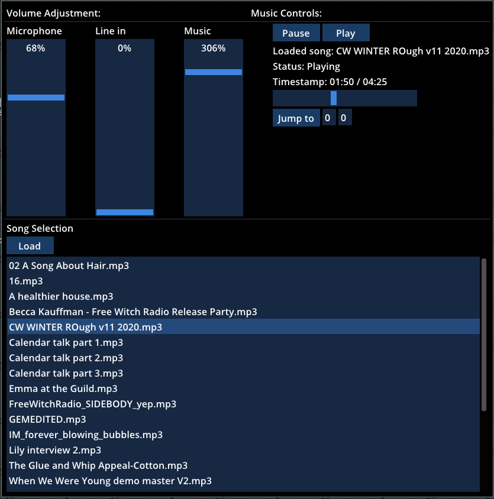
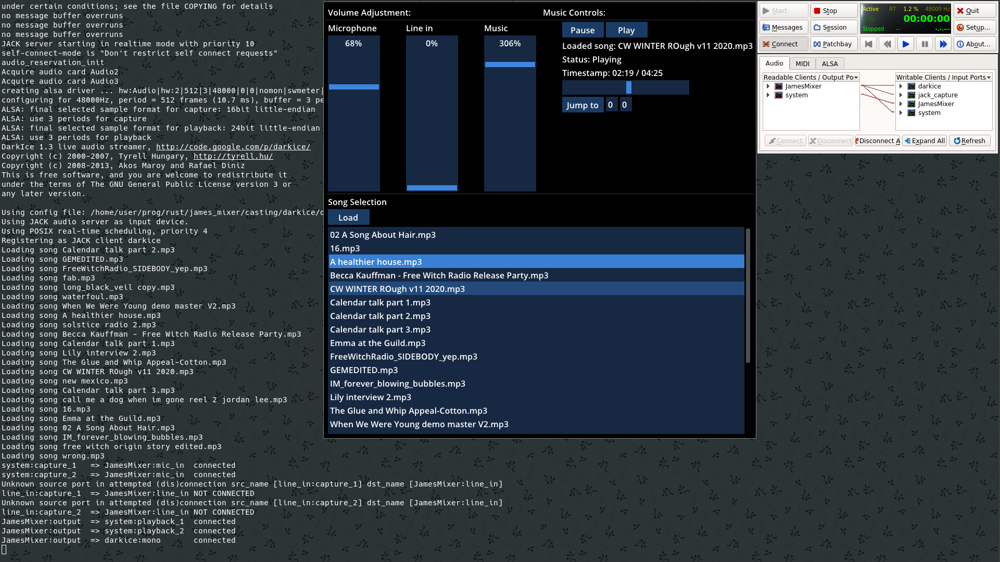
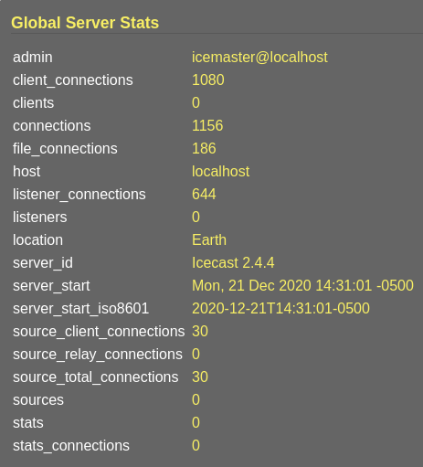

# James' Mixer

A JACK based mixer program for James.
Written in Rust. 
Using Dear ImGui and the imgui-rs wrapper for GUI needs.
Using JACK and minimp3 wrappers provided by the RustAudio group.

If you would like to know about this program, please contact me by opening a
GitHub issue or directly if you have my contact info.

Screenshots of program in use:
 
 

This mixer was used successfully in conjunction with JACK, Icecast2, and 
DarkIce to broadcast live to hunderds of people on December 21, 2020.

Icecast stats page:
 

